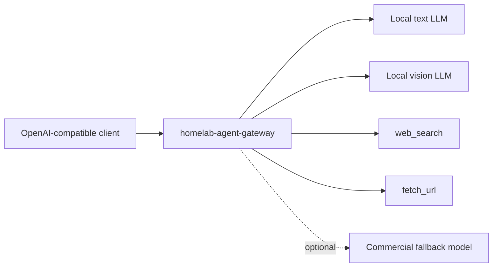

# Homelab Agent Gateway

An OpenAI-compatible Agent API gateway for homelab users who want a low-cost, local-first LLM endpoint with multimodal routing, web tools, URL reading, and optional paid-model fallback.

The gateway exposes a single public model, `homelab-agent`, while orchestrating local text models, vision models, deterministic tools, and optional commercial fallback behind the scenes.

中文文档: [README.zh-CN.md](README.zh-CN.md)

## Why

Running a small local model is cheap and private, but raw inference endpoints are limited:

- no built-in web search
- weak image/video support unless you use a vision model directly
- inconsistent tool calls
- no observability
- no paid-model fallback when the local model gets stuck

Homelab Agent Gateway turns multiple local services into one practical Agent API.



## Features

- OpenAI-compatible `POST /v1/chat/completions`
- One public hybrid model: `homelab-agent`
- Local text model routing
- Local vision model preprocessing for images/videos
- Deterministic URL fetching before generation
- Deterministic search context for timely queries
- OpenAI-style tool calling with built-in tools
- Optional commercial fallback with configurable policy
- Web UI for capability and route configuration
- Request log viewer
- SSRF protection for URL/media fetches
- No Python package dependencies; standard library only

## Quick Start

1. Start your local OpenAI-compatible model servers:

- text model: `http://localhost:8001/v1`
- vision model: `http://localhost:8002/v1`

2. Start the gateway:

```sh
cp .env.example .env
docker compose up -d --build
```

3. Open the UI:

```text
http://localhost:8088/
```

4. Call the hybrid model:

```sh
curl http://localhost:8088/v1/chat/completions \
  -H 'Content-Type: application/json' \
  -d '{
    "model": "homelab-agent",
    "stream": false,
    "messages": [
      {"role": "user", "content": "Summarize https://example.com in one sentence."}
    ]
  }'
```

## Multimodal Example

```sh
curl http://localhost:8088/v1/chat/completions \
  -H 'Content-Type: application/json' \
  -d '{
    "model": "homelab-agent",
    "stream": false,
    "messages": [{
      "role": "user",
      "content": [
        {"type": "text", "text": "What is in this image?"},
        {"type": "image_url", "image_url": {"url": "https://httpbin.org/image/jpeg"}}
      ]
    }]
  }'
```

The gateway downloads the image safely, sends it to the vision model, injects the visual description into the text model request, and returns a final answer as `homelab-agent`.

## Configuration

The web UI writes configuration to `data/config.json`.

Main settings:

- `public_model`: public model name, default `homelab-agent`
- `default_text_model`: local text component model
- `vision_model`: local vision component model
- `model_upstreams`: OpenAI-compatible upstream URLs
- `upstream_models`: actual model names expected by each upstream
- `enable_vision_fusion`: image/video preprocessing
- `enable_auto_context`: deterministic URL/search context injection
- `enable_web_search`: built-in search tool
- `enable_fetch_url`: built-in URL reader
- `enable_commercial_fallback`: optional paid-model fallback

Environment variables are documented in [.env.example](.env.example).

## Commercial Fallback

Commercial fallback is disabled by default. Enable it when you want local-first operation with a paid model as quality gate.

Policies:

- `error_or_empty`: fallback only when the local path errors or returns empty content
- `low_confidence`: also fallback on common low-confidence phrases
- `always`: always use the paid model for the final answer
- `never`: disable fallback even if credentials are configured

## Docs

- [Deployment Guide](docs/deployment.md)
- [Agent LLM Setup](docs/agent-llm-setup.md)
- [Best Practices](docs/best-practices.md)
- [Architecture](docs/architecture.md)

## Screenshots


## License

MIT
