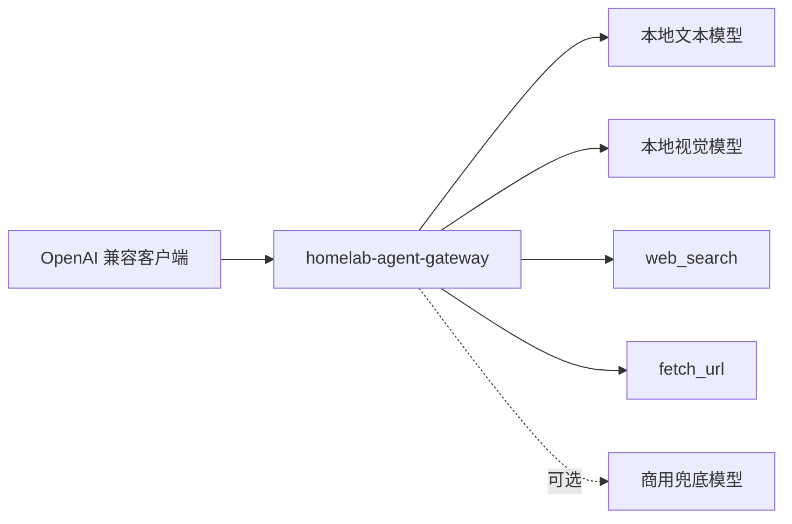
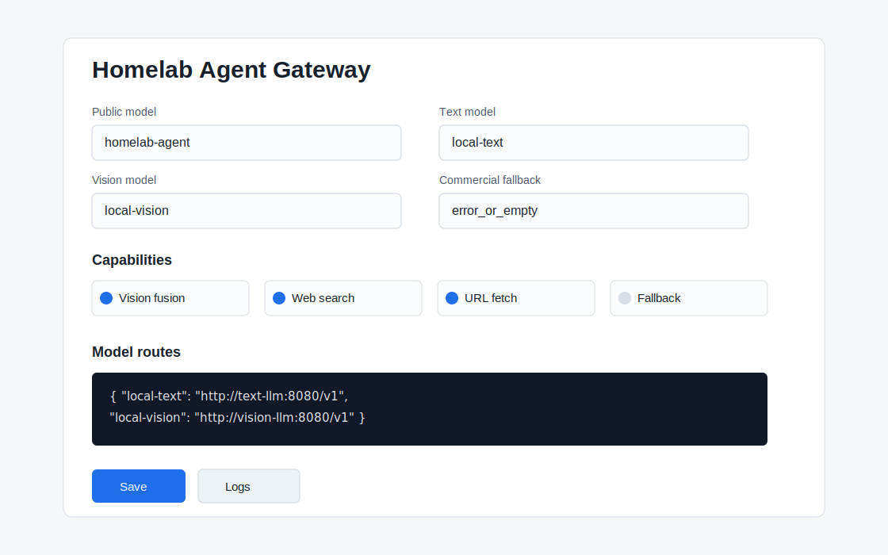

# Homelab Agent Gateway

面向 homelab 用户的 OpenAI 兼容 Agent API 网关，用低成本本地模型组合出一个支持多模态、多工具、联网检索和可选商用模型兜底的自建 LLM 入口。

网关对外暴露一个统一模型 `homelab-agent`，内部自动编排本地文本模型、本地视觉模型、确定性工具和可选商用兜底模型。

English: [README.md](README.md)

## 为什么需要它

本地小模型便宜、隐私好，但裸推理服务通常有明显短板：

- 没有联网搜索
- 图片/视频能力需要单独调用视觉模型
- 工具调用不稳定
- 缺少请求日志和调试面板
- 本地模型答不出来时没有兜底

Homelab Agent Gateway 的目标是把多个本地服务组合成一个好用的 Agent API。



## 功能

- OpenAI 兼容 `POST /v1/chat/completions`
- 对外统一模型：`homelab-agent`
- 本地文本模型路由
- 图片/视频先走本地视觉模型，再交给文本模型回答
- 用户发 URL 时自动抓取正文
- 涉及时效性问题时自动注入搜索上下文
- 内置 OpenAI 风格工具调用
- 可选商用模型兜底
- Web 配置页
- 请求日志查看
- URL/媒体抓取 SSRF 防护
- 无第三方 Python 依赖，仅标准库

## 快速开始

1. 先启动本地 OpenAI 兼容模型服务：

- 文本模型：`http://localhost:8001/v1`
- 视觉模型：`http://localhost:8002/v1`

2. 启动网关：

```sh
cp .env.example .env
docker compose up -d --build
```

3. 打开配置页：

```text
http://localhost:8088/
```

4. 调用混合模型：

```sh
curl http://localhost:8088/v1/chat/completions \
  -H 'Content-Type: application/json' \
  -d '{
    "model": "homelab-agent",
    "stream": false,
    "messages": [
      {"role": "user", "content": "用一句话总结 https://example.com"}
    ]
  }'
```

## 多模态示例

```sh
curl http://localhost:8088/v1/chat/completions \
  -H 'Content-Type: application/json' \
  -d '{
    "model": "homelab-agent",
    "stream": false,
    "messages": [{
      "role": "user",
      "content": [
        {"type": "text", "text": "这张图里是什么？"},
        {"type": "image_url", "image_url": {"url": "https://httpbin.org/image/jpeg"}}
      ]
    }]
  }'
```

网关会安全下载图片，交给视觉模型生成描述，再把视觉描述注入文本模型请求，最终仍以 `homelab-agent` 返回。

## 配置

Web UI 会把配置写入 `data/config.json`。

主要配置：

- `public_model`：对外模型名，默认 `homelab-agent`
- `default_text_model`：本地文本组件模型
- `vision_model`：本地视觉组件模型
- `model_upstreams`：OpenAI 兼容上游地址
- `upstream_models`：各上游真实模型名
- `enable_vision_fusion`：视觉融合
- `enable_auto_context`：自动 URL/搜索上下文
- `enable_web_search`：联网搜索工具
- `enable_fetch_url`：网页读取工具
- `enable_commercial_fallback`：商用模型兜底

环境变量见 [.env.example](.env.example)。

## 商用模型兜底

默认关闭。需要“本地优先，商用模型把关”时再开启。

策略：

- `error_or_empty`：本地报错或空回复才兜底，最省钱
- `low_confidence`：本地低置信回答也兜底
- `always`：每次都让商用模型生成最终回答，成本最高
- `never`：即使配置了也禁用

## 文档

- [部署指南](docs/deployment.md)
- [Agent LLM 部署说明](docs/agent-llm-setup.md)
- [最佳实践](docs/best-practices.md)
- [架构说明](docs/architecture.md)

## 截图



## License

MIT
