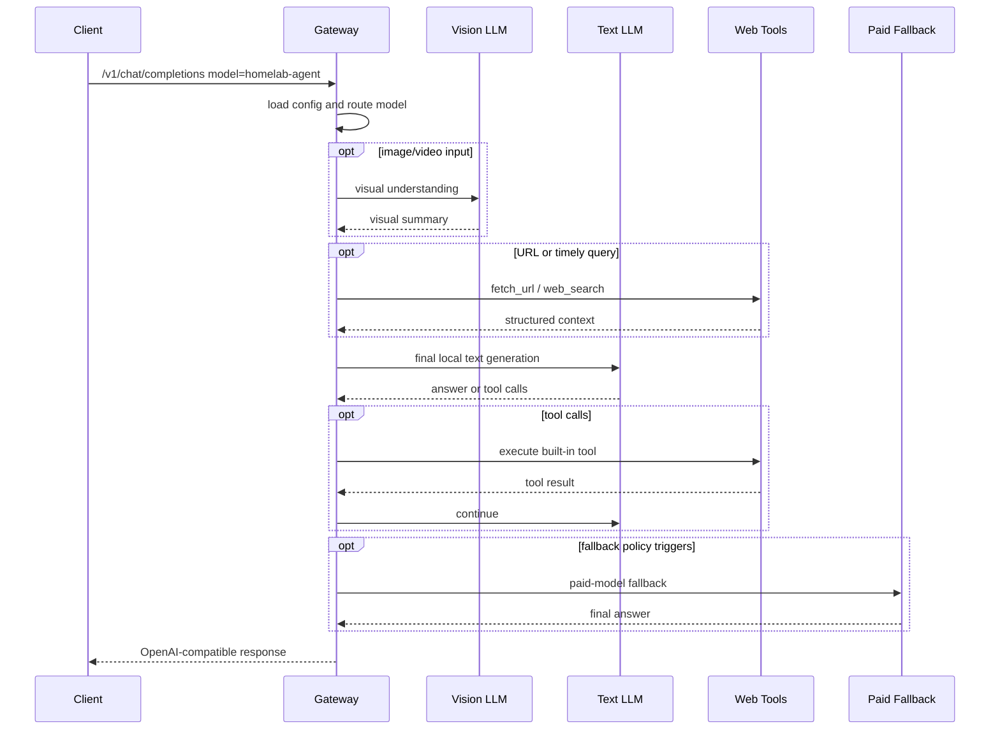
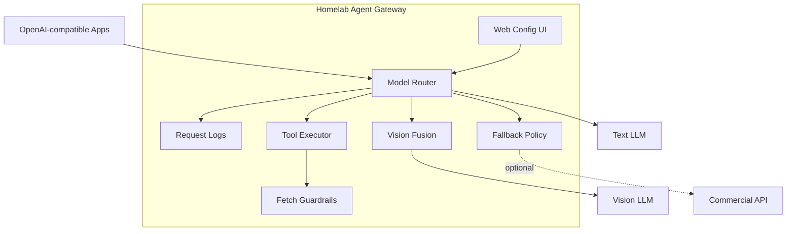

# Architecture / 架构

## Request Flow

## Components

## API Surface

Main endpoints:

- `GET /`
- `GET /health`
- `GET /admin/config`
- `POST /admin/config`
- `GET /admin/logs`
- `GET /v1/models`
- `GET /v1/tools`
- `POST /v1/tools/call`
- `POST /v1/chat/completions`

`/v1/chat/completions` intentionally returns OpenAI-compatible responses so most existing clients can use the gateway by changing only `base_url` and `model`.
